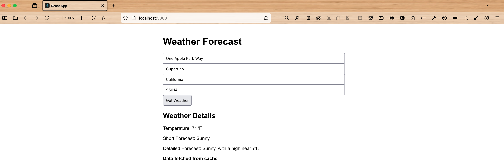

# Intro

This is a full stack example of how to obtain detailed weather information by entering in a specific US based mailing
address into a ReactJS web app named `weatherapp`. 

First, run backend microservice by going inside `backend` directory and then typing in:

`mvn spring-boot:run`

Now, cd into the `frontend` folder of top-level `weatherapp` directory and run the client, following these steps:

## To Configure

Tell Node to use legacy OpenSSL provider.

On macOS or linux:

`export NODE_OPTIONS=--openssl-legacy-provider`

On Windows:

`set NODE_OPTIONS=--openssl-legacy-provider`

On Powershell:

`$env:NODE_OPTIONS = "--openssl-legacy-provider"`

## Run web app

`npm start`

This should launch a browser at http://localhost:3000/

Enter in the mailing address, city, state & zip code inside the form fields and click the `Get Weather` button.

You should see weather info for that particular place!

